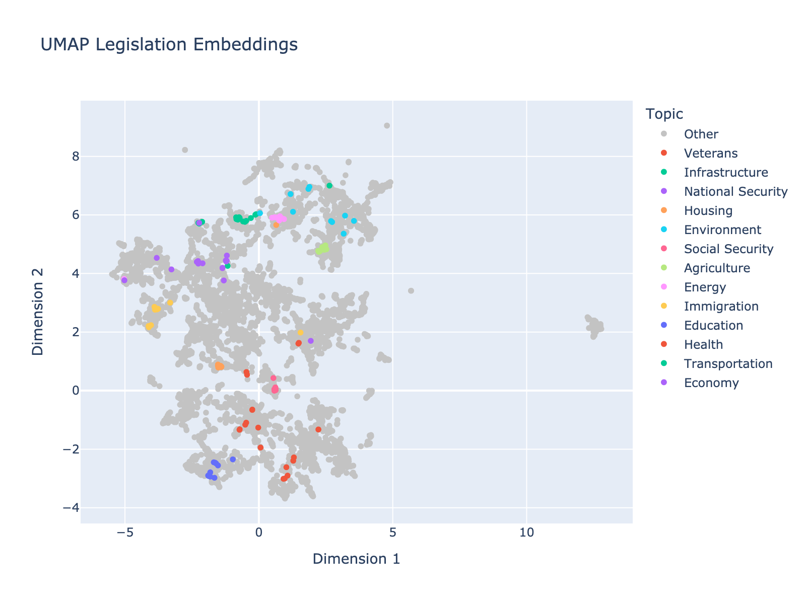

# U.S. Congress Legislation Embeddings

This repository contains code for generating embeddings for legislation from the U.S. Congress.

***

This is an example project to demonstrate how to generate embeddings for documents, such as U.S. Congress legislation.
The document embeddings can be used for a variety of purposes, such as identifying similar legislation.

### Legislation Data

Congress has an official [bulk data API](https://www.govinfo.gov/bulkdata/) for accessing legislation data.
The data is organized by each Congress, their sessions, and includes bills, simple resolutions, joint resolutions, and concurrent resolutions.

| Legislation Type | Short Code |
|:-----------------|:-----------|
| House Concurrent Resolution | `hconres` |
| House Joint Resolution | `hjres` |
| House Bill | `hr` |
| House Resolution | `hres` |
| Senate Bill | `s` |
| Senate Concurrent Resolution | `sconres` |
| Senate Joint Resolution | `sjres` |
| Senate Rule | `sres` |

Each file is in XML format and consists of the legislation text and metadata.

## Usage

### Requirements

This project uses [`uv`](https://github.com/astral-sh/uv) to manage project dependencies.

### Setup

```bash
# Clone the repo
git clone https://github.com/ellisvalentiner/legislation-embeddings.git
# Change into the repo directory
cd legislation-embeddings
# Install dependencies
uv sync
```

### Crawling

This project uses `scrapy` to crawl the bulk data API and extract the data into a format that can be used for training embeddings.
The crawler is configured to start at the beginning of each Congress, crawl through the nested directory structure, and extract all legislation.
The legislation data are XML files containing the legislation text and metadata.

You can run the crawler with:

```bash
scrapy crawl legislation
```

This will walk the hierarchy of the Congress legislation API and download all legislation data into a directory (`/data`).
It also creates a `download_state.json` file that tracks the state of the crawler doesn't download legislation that has already been downloaded.
Re-running the crawler will skip legislation that has already been downloaded, although it will still crawl through the hierarchy.

### Embedding

The legislation data is then processed to generate embeddings using the [all-MiniLM-L6-v2](https://huggingface.co/sentence-transformers/all-MiniLM-L6-v2) model.
This is a relatively small model, so it's possible to run this code locally on a laptop.
The model is a sentence transformer model that can embed the entire text of a legislation document to a 384-dimensional vector.

The embeddings are stored in a [Chroma](https://www.trychroma.com/) vector database (in the `/embeddings` directory).

You can generate and store embeddings for legislation using the following code:

```bash
uv run process
```

By default, only 10,000 random legislation files are processed.
You can change the number of files processed by setting the `limit` parameter in the `config.py` file or by passing the `--limit` argument to the script.

```bash
# Reduce the number of files processed to 100
uv run process --limit 100
```

:notebook: Note any of the `Config` parameters can be changed by their command line arguments.

### Search

Once the data is processed and embeddings are stored in the vector database, the embeddings can be searched.

For example, to search the vector database for legislation related to the Judiciary, you can run the following code:

```bash
uv run search --query "Judiciary"
# 115 S296 IS: Federal Courts of Appeals Modernization Act
# 118 S5229 IS: Judicial Modernization and Transparency Act
# 117 HR 6577 IH: Real Courts, Rule of Law Act of 2022
# 118 S833 IS: Sunshine in the Courtroom Act of 2023
# 115 HRES 105 IH: Expressing the Sense of the House of Representatives that an Independent Judiciary is Fundamental to American Democracy.
```

Note the results include legislation without "Judiciary" in the title but likely related to the Judiciary based on the context.

### Semi-supervised Learning

The embeddings can be used for semi-supervised learning by labeling the embeddings with topic tags.

By querying the legislation embeddings, you can retrieve a list of the most similar legislation to a given topic.
The matching legislation can be used as examples for training a supervised model, such as a classifier, to classify new legislation files.


For example, to label the embeddings with topic tags, you can run the following code:

```bash
uv run label
```

This will label 10 legislation files per topic with tags and save the labeled embeddings to a CSV file (`labeled_embeddings.csv`).
By default, the topics are: agriculture, economy, education, energy, environment, health, housing, immigration, infrastructure, national security, social security, transportation, veterans.

You can generate model provided labels for your own topics by providing a comma-separated list to the `--topics` flag:

```bash
uv run label --topics=speech,gun,car
```

:notebook: Note it is possible for a topic to not have any matching legislation.

In practice, legislation likely should be labeled with multiple topics, and the labels may not be mutually exclusive.
For example, a legislation may be labeled with both "economy" and "health" topics.
However, for the purpose of this project, we will only use one topic per legislation.

### Dimensionality Reduction and Visualization

Visualizing the legislation embeddings can be useful for understanding the data.
Since the embeddings are 384-dimensional vectors, we need to reduce them to a lower dimensional space for visualization.

The embeddings can be reduced to two dimensions for visualization using [Uniform Manifold Approximation and Projection (UMAP)](https://umap-learn.readthedocs.io/en/latest/).

To reduce the embeddings to 2D space, run the following command:

```bash
uv run reduce
```

This will generate a CSV file (`reduced_embeddings.csv`) with the embeddings reduced to a 2D space.

The embeddings can be visualized using Plotly.

```bash
uv run visualize
```

This will generate a PNG file (`fig-topic.png`) with each point colored by the topic label.



Since we only labeled a sample of legislation with topics, most points are colored gray.
The legislation are organized into a discernible structure, rather than being randomly scattered.
This suggests that the embeddings are capturing context or properties of the legislation.
There are several outlier points and clusters that are far from the rest of the data.

The labeled legislation are colored by topic.
We can see, for most topics, legislation with the same label tend to be close to each other in the 2D space.
However, some the legislation for some topics are more spread out.
This may be due to the fact that some topics are governed by a wider range of legislation or that some topic keywords may have multiple meanings.
For example, the topic "Environment" may refer to environmental issues, the environmental impact of legislation, or simply the "political environment" whereas "Agriculture" has a more singular meaning.

### Outliers

We can look for outliers – legislation that is not closely located to other legislation.
These are legislation that are not near other legislation in the lower dimensional space.

The outliers can be found using the following code:

```bash
uv run outlier
# 117 S217 IS: Patient Matching Improvement Act of 2021
# 115 HR 2872 IH: Promoting Hydropower Development at Existing Nonpowered Dams Act
# 116 HR 6020 EH: To require an evaluation by the Government Accountability Office of the social, economic, and historic contributions that Minor League Baseball has made to American life and culture.
# 114 HR 1033 IH: John P. Parker House Study Act
# 115 HR 220 ENR: To authorize the expansion of an existing hydroelectric project, and for other purposes.
```

## Wrap-up

This project demonstrates how to generate embeddings for legislation using the U.S. Congress API.
The embeddings can be used for a variety of purposes, such as identifying similar legislation.
